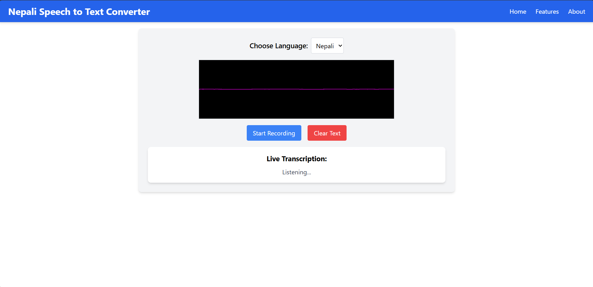

# Nepali Speech-to-Text Converter

Nepali Speech-to-Text Converter is a simple web application that allows users to convert their Nepali speech into text. The app records your voice and provides the transcription in real time.

## Features
- **Speech Recording**: Record Nepali speech with a single click.
- **Real-Time Transcription**: Get the transcription of your speech immediately after recording.
- **Language Support**: Currently supports Nepali (नेपाली).
- **User-Friendly Interface**: Clean and intuitive design.

## Prerequisites
- **Node.js**: Ensure you have Node.js installed on your system.
- **Python Backend**: This app requires a Python backend server to handle recording and transcription.

## Installation

1. **Clone the Repository**:
   ```bash
   git clone https://github.com/yogendrabaskota/NepaliASR.git
   cd speech
   ```

2. **Install Dependencies**:
   ```bash
   npm install
   ```

3. **Setup Tailwind CSS**:
   Tailwind CSS is already configured in the project. If needed, refer to the [Tailwind CSS documentation](https://tailwindcss.com/docs/installation) for additional setup information.

4. **Start the Development Server**:
   ```bash
   npm run dev
   ```

5. **Run the Python Backend**:
   Ensure the Python backend server is running. The backend is responsible for handling recording and transcription. Use the following commands:
   ```bash
   cd backend
   python main.py
   ```

## Usage

1. Open the app in your browser:
   ```
   http://localhost:5173
   ```

2. Click on the "Start Recording" button.
3. Speak in Nepali language for the required time and click on 'stop' button when you finished speaking.
4. View the transcription in the "Live Transcription" section. You can also copy the text by clicking 'copy' button available there.

## File Structure
```
project-root/
├── public/
├── src/
│   ├── components/
│   │   ├── Navbar.jsx
│   │   ├── Recorder.jsx
│   ├── App.jsx
│   ├── index.css
│   ├── main.jsx
├── backend/
|   ├──models/
|   ├──recordings/
|   ├──utils/
│   ├── main.py
├── tailwind.config.js
├── postcss.config.js
├── package.json
└── README.md
```

## Technologies Used

- **Frontend**:
  - React
  - Vite
  - Tailwind CSS

- **Backend**:
  - Python (Flask or FastAPI for handling API requests)

- **ML**
  - Recurrent Neural Network (RNN) for processing speech to text

## Output



## Contributing
Contributions are welcome! Feel free to open an issue or submit a pull request.


---

## Feedback
  If you have any feedback, please reach out to yogendrabaskota18@gmail.com , awasthintr07@gmail.com

**Happy Coding!**
